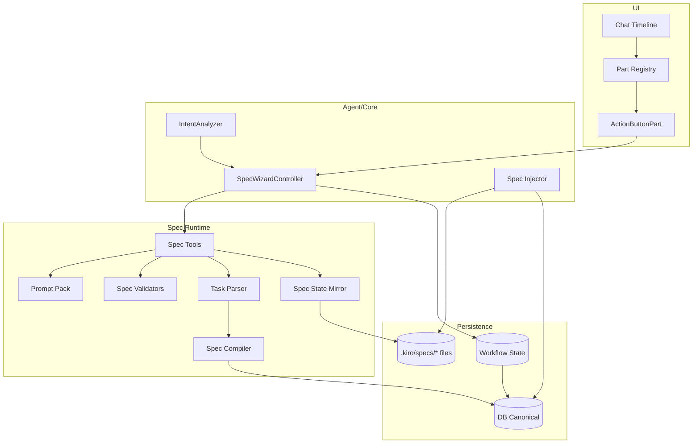
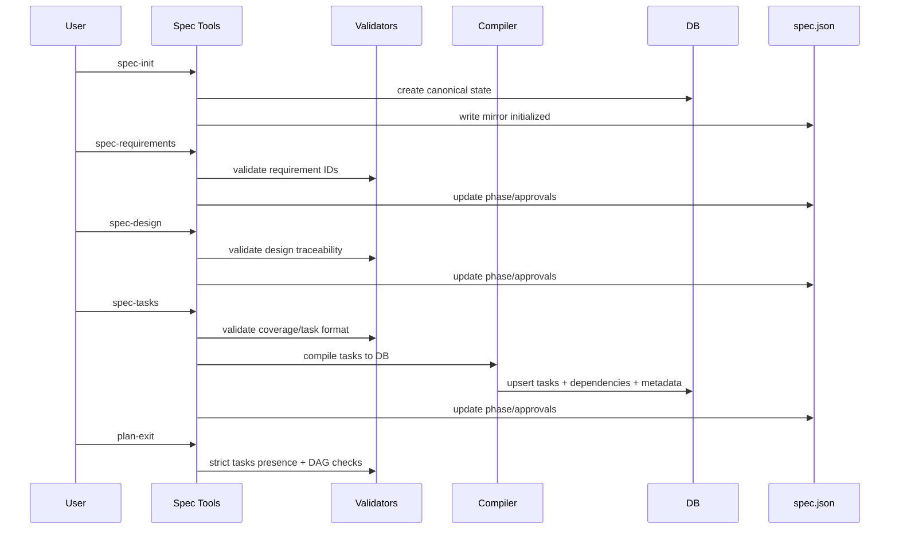
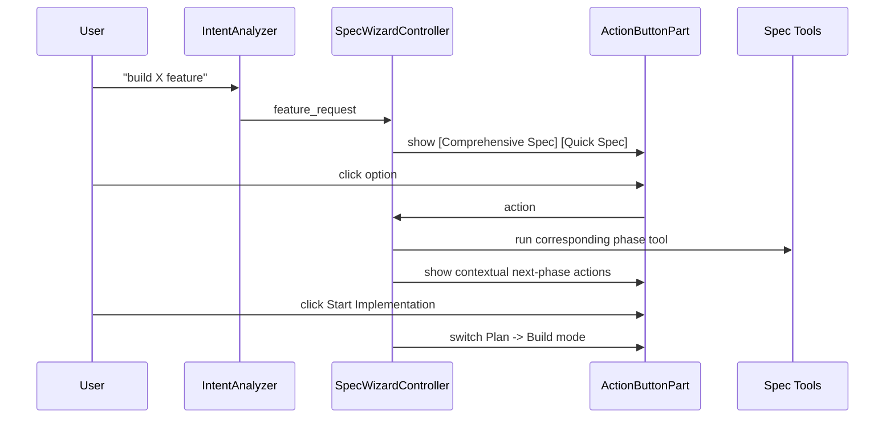
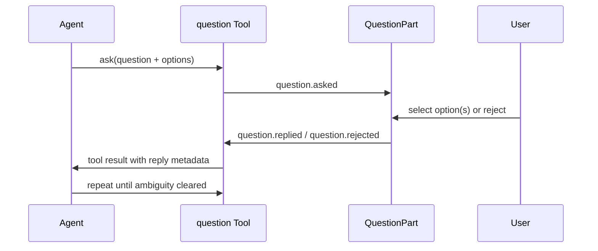

# Design Document: Spec Generation Quality & Workflow UX

## Overview

This design implements two coupled tracks:

1. **Parity-plus core**: spec generation quality parity with deterministic runtime guarantees.
2. **Workflow UX**: conversational wizard and action buttons to make the lifecycle usable without memorizing commands.

Both tracks preserve existing architecture constraints:

- Database-backed runtime state is canonical.
- `spec.json` is a mirror, not source of truth.
- Critical invariants are enforced in code and validators, not only prompts.

## Goals

- Deliver phase tools, prompt pack, validators, and parser/compiler metadata upgrades.
- Add user-facing conversational workflow with reliable state persistence.
- Keep backward compatibility for existing slash-command and parser behavior where required.

## Non-Goals

- Replacing Plan/Build mode architecture.
- Replacing slash-command flows with wizard-only UX.
- Replacing canonical DB state with markdown-only state.

## Architecture

### High-Level Boundary Map



### Core Track Components

1. **SpecStateMirrorService** (`readSpecState`, `writeSpecState`)
2. **TaskParser** (safe + strict APIs, `(P)` and `- [ ]*` parsing)
3. **SpecCompiler** (metadata persistence + dependency integrity)
4. **SpecValidators** (requirements, traceability, task format, dependency DAG)
5. **Spec Tools Suite** (`spec-init`, `spec-requirements`, `spec-design`, `spec-tasks`, `spec-status`, `spec-quick`, validation tools)
6. **Prompt Pack** (shared policies + phase prompts)
7. **Spec Injector** (phase/approval/validation context injection)

### UX Track Components

1. **ActionButtonPart** (chat timeline button rendering)
2. **WorkflowStateManager** (session-scoped wizard state)
3. **IntentAnalyzer** (proactive spec-wizard offer)
4. **SpecWizardController** (phase-aware orchestration and mode transition)
5. **Question Tool Loop** (`question` tool + pending/reply/reject lifecycle) for structured, option-based clarification before phase transitions

## Data Models

### Spec Mirror (`spec.json`)

```json
{
  "feature_name": "spec-generation-quality",
  "created_at": "ISO-8601",
  "updated_at": "ISO-8601",
  "language": "en",
  "phase": "initialized | requirements-generated | design-generated | tasks-generated",
  "approvals": {
    "requirements": { "generated": false, "approved": false },
    "design": { "generated": false, "approved": false },
    "tasks": { "generated": false, "approved": false }
  },
  "ready_for_implementation": false
}
```

### Parsed Task Model

```ts
interface ParsedTask {
  id: string;
  title: string;
  requirements: string[];
  dependencies: string[];
  outcome: string;
  notes: string;
  subtasks: string[];

  // New parity-plus fields
  parallel: boolean;
  hasOptionalTestSubtasks: boolean;
  subtasksDetailed: Array<{ text: string; optionalTest: boolean }>;
}
```

### Task Metadata Persistence

```ts
interface SpecMetadata {
  spec: {
    slug: string;
    taskId: string;
    requirements: string[];
    parallel?: boolean;
    hasOptionalTestSubtasks?: boolean;
    subtasks?: Array<{ text: string; optionalTest: boolean }>;
  };
}
```

### Workflow State

```ts
interface SpecWorkflowState {
  sessionId: string;
  specSlug?: string;
  phase: "init" | "requirements" | "design" | "tasks" | "complete";
  specType?: "comprehensive" | "quick";
  responses: Array<{ phase: string; payload: Record<string, unknown> }>;
  updatedAt: number;
}
```

## Contracts

### Validation Response Contract

```ts
type SpecValidationResponse = {
  ok: boolean;
  phase: "gap" | "design" | "impl";
  errors: Array<{ code: string; message: string; location?: string }>;
  warnings: Array<{ code: string; message: string; location?: string }>;
  summary: string;
  nextSteps: string[];
};
```

### Action Button Part Contract

```ts
interface ActionButtonPartData {
  type: "action_buttons";
  buttons: Array<{
    id: string;
    label: string;
    variant: "primary" | "secondary";
    action: string;
    metadata?: Record<string, unknown>;
  }>;
  loadingButtonId?: string;
}
```

### Intent Analyzer Contract

```ts
interface IntentAnalyzer {
  analyze(message: string): { kind: "feature_request" | "other"; confidence: number };
  shouldOfferWizard(result: { kind: string; confidence: number }): boolean;
}
```

## System Flows

### Flow 1: Parity-Plus Spec Lifecycle



### Flow 2: Conversational Wizard UX



### Flow 3: Structured Clarification Loop



Rules:

1. Clarification prompts should prefer option-based answers with recommended option first.
2. The loop can repeat until blockers are resolved; this is not treated as a doom loop condition.
3. Spec phase transitions should only proceed after required clarifications are answered or explicitly rejected.

## Agent Wizard Assessment and Guardrails

The wizard is a high-value UX layer for discoverability and completion rate, but it is only acceptable as an orchestration layer over existing spec tools and validators.

### Architecture Boundary

1. The wizard is not an alternative execution path.
2. Every wizard action must resolve to the same `spec-*` tools used by slash-command flows.
3. The wizard must not introduce separate invariants or bypass existing compile/validation gates.

### Required Guardrails (Non-Negotiable)

1. **DB canonical state:** database remains source of truth; `spec.json` remains mirror state only.
2. **Idempotent action handling:** repeated button actions must not create duplicate phase transitions or writes.
3. **Transition lock:** only one active phase transition per session at a time.
4. **Gate parity:** wizard-triggered transitions must run the same validators as command-triggered transitions.
5. **Intent controls:** proactive wizard offer requires confidence threshold and user/session opt-out.
6. **Audit trail:** each button click must map to logged action -> tool call -> result.
7. **Fallback safety:** if wizard state is stale or invalid, fail to a deterministic command recommendation instead of silent continuation.

### Rollout and Observability Conditions

1. Ship behind a feature flag initially.
2. Record false-positive and false-negative intent metrics.
3. Record wizard abandon rate by phase.
4. Record transition-failure causes by validator code.
5. Promote to default only after parity with slash-command reliability is demonstrated.

## Wizard Operational Flow (Unambiguous)

### Canonical States

1. `spec.json.phase` (artifact lifecycle): `initialized`, `requirements-generated`, `design-generated`, `tasks-generated`.
2. `spec.json.approvals` (review lifecycle): `requirements|design|tasks` each has `generated` and `approved`.
3. `workflow_state.phase` (UI interaction lifecycle): `init`, `requirements`, `design`, `tasks`, `complete`.
4. `workflow_state.transition_lock` (concurrency guard): `{ status, ownerActionId, acquiredAt, expiresAt }`.

### Entry Conditions

1. Wizard is only proactive in Plan mode.
2. Intent offer is shown only when `IntentAnalyzer.shouldOfferWizard(...)` is true.
3. Before first phase action, a session title is generated once if absent.
4. If a transition lock is active and unexpired, phase-advance clicks are ignored except status refresh.
5. If workflow state exists for the session, wizard resumes from persisted phase.

### Phase Transition Table

| UI Action                           | Tool/Operation                                                                            | Preconditions                                                   | Success Result                                                                                    | Failure Result                                                    |
| ----------------------------------- | ----------------------------------------------------------------------------------------- | --------------------------------------------------------------- | ------------------------------------------------------------------------------------------------- | ----------------------------------------------------------------- |
| `Comprehensive Spec`                | `generate-session-title` (if missing), `spec-init` (if missing), then `spec-requirements` | Plan mode, lock acquired                                        | `requirements.generated=true`, `requirements.approved=false`, `workflow_state.phase=requirements` | Show validation/tool error and exact retry command                |
| `Quick Spec`                        | `generate-session-title` (if missing), `spec-quick` (`auto` or `interactive`)             | Plan mode, lock acquired                                        | Progresses by quick path and returns checkpoint                                                   | Returns checkpoint + blockers; no silent skip                     |
| `Add More Requirements`             | `spec-requirements` (revision pass)                                                       | requirements phase active                                       | `requirements.md` updated, approvals reset if content changed                                     | Stays in requirements phase with blocker codes                    |
| `Approve Requirements and Continue` | optional `spec-validate-gap`, then `spec-design` (transactional approval update)          | requirements generated, lock acquired, blockers clear           | `requirements.approved=true`, `design.generated=true`, `workflow_state.phase=design`              | Stays in requirements phase; `requirements.approved` is unchanged |
| `Request Changes`                   | `spec-design` with feedback context                                                       | design phase active                                             | `design.md` revised, approvals reset if content changed                                           | Stays in design phase with explicit errors                        |
| `Approve Design and Continue`       | `spec-tasks` (transactional approval update)                                              | design generated, lock acquired                                 | `design.approved=true`, `tasks.generated=true`, `workflow_state.phase=tasks`                      | Stays in design phase; `design.approved` is unchanged             |
| `Approve Tasks`                     | `spec-validate-impl` + readiness gates                                                    | tasks generated, design approved, blockers clear                | `tasks.approved=true`, `ready_for_implementation=true`, `workflow_state.phase=complete`           | Stays in tasks phase with failed-check summary                    |
| `Start Implementation`              | mode switch `Plan -> Build`                                                               | `ready_for_implementation=true` and all required approvals true | Build mode enabled, workflow marked complete                                                      | No mode switch; show unmet preconditions                          |

### Approval and Readiness Rules

1. `ready_for_implementation` must remain `false` until tasks are generated and implementation validation passes.
2. Any artifact rewrite in a prior phase invalidates downstream approvals.
3. Wizard and slash-command paths mutate the same approval fields and mirror structure.
4. `requirements.approved` can only be set by `Approve Requirements and Continue`.
5. `design.approved` can only be set if `spec-tasks` succeeds in the same transition.
6. `tasks.approved` can only be set after readiness gates pass.

### Error and Recovery Flow

1. **Mirror write failure:** keep DB result, warn user, suggest `spec-status` to confirm canonical state.
2. **Stale workflow state:** reload from DB + `spec.json`, then re-render actions for resolved phase.
3. **Validator failure:** do not advance phase; return `errors`, `warnings`, `nextSteps`.
4. **Duplicate click race:** second click receives no-op response while first transition holds lock.
5. **Tool exception:** release lock, persist failure event, and return deterministic retry command.

### Audit Trail Requirements

1. Every wizard action stores: `sessionId`, `actionId`, `phaseBefore`, `toolName`, `toolResult.ok`, `phaseAfter`, `timestamp`.
2. Every failed transition stores validator/tool codes for observability and debugging.

### Action Routing and Idempotency Contract

All clickable actions must map to canonical routing entries.

| Action ID                     | Operation                                                    | Idempotency Key                          |
| ----------------------------- | ------------------------------------------------------------ | ---------------------------------------- |
| `wizard:start:comprehensive`  | `generate-session-title?`, `spec-init?`, `spec-requirements` | `sessionId:phase:actionId:specUpdatedAt` |
| `wizard:start:quick`          | `generate-session-title?`, `spec-quick`                      | `sessionId:phase:actionId:specUpdatedAt` |
| `wizard:requirements:revise`  | `spec-requirements`                                          | `sessionId:phase:actionId:specUpdatedAt` |
| `wizard:requirements:approve` | `spec-validate-gap?`, `spec-design`                          | `sessionId:phase:actionId:specUpdatedAt` |
| `wizard:design:revise`        | `spec-design`                                                | `sessionId:phase:actionId:specUpdatedAt` |
| `wizard:design:approve`       | `spec-tasks`                                                 | `sessionId:phase:actionId:specUpdatedAt` |
| `wizard:tasks:approve`        | `spec-validate-impl` + readiness checks                      | `sessionId:phase:actionId:specUpdatedAt` |
| `wizard:start-implementation` | mode switch `Plan -> Build`                                  | `sessionId:phase:actionId:specUpdatedAt` |
| `spec-status`                 | `spec-status`                                                | none                                     |

Duplicate action requests with the same idempotency key must return the first completed result and must not re-run mutating operations.

### Transition Lock Semantics

1. Lock acquisition must be atomic (`compare-and-set`) in persistent storage.
2. Lock record fields: `ownerActionId`, `ownerSessionId`, `acquiredAt`, `expiresAt`.
3. Locks expire automatically (TTL) to prevent deadlock; expired lock can be reclaimed with audit log entry.
4. Lock release must happen in `finally` for all execution paths.
5. A request with non-owner action ID cannot release another action's lock.

### State Reconciliation Precedence

1. DB-backed runtime entities are canonical for execution and task graph state.
2. `spec.json` is canonical for mirrored phase/approval view when DB does not yet expose equivalent fields.
3. `workflow_state` is a projection used for UI flow and must be recomputed from canonical sources on mismatch.
4. On DB/mirror mismatch: trust DB/runtime outcome, rewrite mirror to match, and emit a warning event.
5. On workflow mismatch: rebuild workflow phase from canonical phase + approvals, then re-render buttons.

### Quick Path Minimum Safety Gates

Even for `spec-quick --auto`, `ready_for_implementation` must remain false until all pass:

1. Requirement ID validation (`validateRequirementIds`)
2. Design traceability validation (`validateDesignTraceability`)
3. Requirement-to-task coverage (`validateTasksCoverage`)
4. Task format validation (`validateTaskFormat`)
5. Dependency validity checks (unknown dependencies rejected)
6. Dependency DAG validation (cycle-free)

### Button Event Security and Integrity

1. Every rendered button action includes a server-issued action token bound to: `sessionId`, `userId`, `phase`, `actionId`, `expiresAt`.
2. Backend must reject clicks with missing/expired/mismatched tokens.
3. Backend must reject actions not valid for current resolved phase (even if token exists).
4. Token validation happens before lock acquisition and tool invocation.
5. Replayed valid tokens must be handled via idempotency contract.

### Wizard Action Resolver Contract

Button rendering must be derived from state using deterministic policy logic, not free-form model choice.

#### Resolver Inputs

1. `runtimeMode` (`plan` or `build`)
2. Feature flags (`wizardEnabled`)
3. User/session preference (`wizardOptOut`)
4. `workflow_state.phase`
5. `workflow_state.transition_lock`
6. `spec.json.phase` and approvals
7. Latest blockers/validator outcomes
8. Intent analysis result (`kind`, `confidence`, threshold)

#### Resolver Output

Returns ordered `action_buttons` payload:

```ts
type WizardButton = {
  id: string;
  label: string;
  action: string;
  variant?: "primary" | "secondary";
  disabled?: boolean;
};
```

#### Deterministic Rendering Rules

1. If `runtimeMode !== "plan"`, return no wizard suggestion buttons.
2. If `wizardEnabled` is false or `wizardOptOut` is true, return no proactive wizard buttons.
3. If `transition_lock.status === "busy"` and current time is before `transition_lock.expiresAt`, return only status/safe actions and suppress phase-advance buttons.
4. If no workflow exists and intent is confident feature request, render initial entry options:
   - `Comprehensive Spec`
   - `Quick Spec`
5. If workflow exists, render only actions allowed for current phase and blockers.
6. Buttons that would violate preconditions must be shown disabled or omitted (implementation choice must be consistent).
7. `Start Implementation` is rendered enabled only when `ready_for_implementation === true`.

#### Reference Resolver Pseudocode

```ts
function resolveWizardActions(ctx: {
  runtimeMode: "plan" | "build";
  flags: { wizardEnabled: boolean };
  user: { wizardOptOut: boolean };
  lock: { status: "idle" | "busy"; expiresAt?: number };
  workflow: null | { phase: "init" | "requirements" | "design" | "tasks" | "complete" };
  intent: { kind: "feature_request" | "other"; confidence: number };
  intentThreshold: number;
  blockers: { requirements: string[]; design: string[]; tasks: string[] };
  readyForImplementation: boolean;
}): WizardButton[] {
  if (ctx.runtimeMode !== "plan") return [];
  if (!ctx.flags.wizardEnabled || ctx.user.wizardOptOut) return [];

  if (ctx.lock.status === "busy" && (!ctx.lock.expiresAt || Date.now() < ctx.lock.expiresAt)) {
    return [
      {
        id: "working",
        label: "Working...",
        action: "wizard:noop",
        disabled: true,
        variant: "secondary",
      },
      { id: "status", label: "Show Status", action: "spec-status", variant: "secondary" },
    ];
  }

  if (!ctx.workflow) {
    if (ctx.intent.kind === "feature_request" && ctx.intent.confidence >= ctx.intentThreshold) {
      return [
        {
          id: "start-comprehensive",
          label: "Comprehensive Spec",
          action: "wizard:start:comprehensive",
          variant: "primary",
        },
        {
          id: "start-quick",
          label: "Quick Spec",
          action: "wizard:start:quick",
          variant: "secondary",
        },
      ];
    }
    return [];
  }

  if (ctx.workflow.phase === "requirements") {
    return [
      {
        id: "add-req",
        label: "Add More Requirements",
        action: "wizard:requirements:revise",
        variant: "secondary",
      },
      {
        id: "to-design",
        label: "Approve Requirements and Continue",
        action: "wizard:requirements:approve",
        variant: "primary",
        disabled: ctx.blockers.requirements.length > 0,
      },
    ];
  }

  if (ctx.workflow.phase === "design") {
    return [
      {
        id: "request-changes",
        label: "Request Changes",
        action: "wizard:design:revise",
        variant: "secondary",
      },
      {
        id: "approve-design",
        label: "Approve Design and Continue",
        action: "wizard:design:approve",
        variant: "primary",
      },
    ];
  }

  if (ctx.workflow.phase === "tasks") {
    return [
      {
        id: "approve-tasks",
        label: "Approve Tasks",
        action: "wizard:tasks:approve",
        variant: "primary",
        disabled: ctx.blockers.tasks.length > 0,
      },
      { id: "edit-spec", label: "Edit Spec", action: "spec-status", variant: "secondary" },
    ];
  }

  if (ctx.workflow.phase === "complete") {
    return [
      {
        id: "start-implementation",
        label: "Start Implementation",
        action: "wizard:start-implementation",
        variant: "primary",
        disabled: !ctx.readyForImplementation,
      },
      { id: "edit-spec", label: "Edit Spec", action: "spec-status", variant: "secondary" },
    ];
  }

  return [];
}
```

## Hard Invariants

1. Missing `tasks.md` fails strict parser and plan-exit.
2. Task without mapped requirement ID fails compile/transition.
3. Unknown dependency references fail compile/transition.
4. Dependency graph cycles fail transition.
5. Requirement ID format violations fail validation gates.
6. Design/tasks traceability gaps fail phase progression.

## Error Handling

| Scenario                              | Handling                                           |
| ------------------------------------- | -------------------------------------------------- |
| DB write succeeds, mirror write fails | Warn and continue (DB canonical)                   |
| DB write fails                        | Return error and block transition                  |
| `tasks.md` missing in strict path     | Fail with actionable message                       |
| Dependency cycle detected             | Return machine-checkable error code and cycle path |
| Intent confidence low                 | Do not proactively show wizard                     |
| Button clicked during pending action  | Keep one active action and ignore duplicate click  |

## Testing Strategy

### Unit Tests

- `state.ts`: read/write mirror, missing file behavior.
- `parser.ts`: strict/safe, `(P)` parsing, `- [ ]*` parsing.
- `compiler.ts`: metadata persistence, unknown dependency handling.
- `validators.ts`: ID format, coverage, traceability, DAG/unknown dependency checks.
- Prompt integrity tests for all required constants.
- UX tests for `ActionButtonPart`, `IntentAnalyzer`, `WorkflowStateManager`.

### Integration Tests

- End-to-end spec flow (init -> requirements -> design -> tasks -> validate).
- Deterministic guard tests for invalid transitions.
- Wizard flow: intent detection -> buttons -> tool execution.
- Plan -> Build mode transition from `Start Implementation` button.
- Duplicate click race: single transition and single write set.
- Stale wizard state: deterministic error and safe recovery path.
- Wizard-triggered phase transition executes the same validator set as slash-command path.
- Requirements approval transition is explicit and tested (`wizard:requirements:approve`).
- Design approval remains unchanged when `spec-tasks` fails.
- Action-token validation rejects expired/mismatched clicks.
- Idempotency key replay returns cached result without duplicate writes.
- Expired lock recovery path is tested (lock reclaim + audit entry).

### Regression Tests

- Existing parser safe behavior compatibility.
- Existing slash-command flows remain functional.

## Requirements Traceability

| Requirement | Implemented By                                                |
| ----------- | ------------------------------------------------------------- |
| R-001       | SpecStateMirrorService, `spec-init`, `plan-enter` wiring      |
| R-002       | `parseTasksMdStrict`, `parseTasksMdSafe`, compatibility alias |
| R-003       | Task parser title normalization and `parallel` metadata       |
| R-004       | Subtask parser extension and optional-test metadata           |
| R-005       | Compiler metadata persistence (`metadata.spec.*`)             |
| R-006       | `plan-exit` strict parser path and explicit failure messaging |
| R-007       | Validators module + dependency graph checks                   |
| R-008       | `spec-validate-*` tools + registry + phase-tool mapping       |
| R-009       | Prompt pack modules and policy composition                    |
| R-010       | `spec-*` lifecycle tools + state updates                      |
| R-011       | `research.md` lifecycle support in init/design/status         |
| R-012       | Discovery mode classifier + persisted mode output             |
| R-013       | Requirement ID normalization utility + phase gate enforcement |
| R-014       | `spec-quick` orchestration and checkpoint handling            |
| R-015       | Enhanced status summary/blockers/next action                  |
| R-016       | Spec injector phase/approval/validation context               |
| R-017       | Prompt integrity + snapshot tests                             |
| R-018       | Full parity integration test                                  |
| R-019       | Deterministic invalid-transition guard tests                  |
| R-020       | Public exports across prompts/tools/spec modules              |
| R-021       | SpecWizardController + contextual button strategy             |
| R-022       | ActionButtonPart + click/loading contract                     |
| R-023       | WorkflowStateManager with DB canonical persistence            |
| R-024       | IntentAnalyzer config, thresholds, and feedback path          |

## Implementation Sequence

1. Core state/parser/compiler/plan-exit hardening.
2. Validators and validation tooling.
3. Prompt pack and spec phase tool integration.
4. Spec injector and status enhancements.
5. UX part rendering + workflow state + intent analyzer.
6. Wizard orchestration and mode transition.
7. Full integration and regression test pass.

## Spec Generation Prompt Pack (Non-Negotiable)

This section is normative. The prompt content below is the baseline to use for spec-generation phases unless a later approved revision explicitly replaces it.

# Next-Gen Spec Prompt Suite

## Objective

Provide a production-grade prompt suite for our planner/spec system that reaches and exceeds cc-sdd quality while preserving our runtime guarantees.

This suite is designed for direct adoption in `ekacode` and aligns with:

- session runtime modes (`plan`/`build`)
- parser/compiler pipeline
- DB-backed task graph
- spec context injection

---

## Design Principles

1. Runtime invariants stay in code.
2. Prompts enforce structure, clarity, and artifact quality.
3. Every phase has explicit inputs, outputs, and failure paths.
4. Context loading is deterministic and auditable.
5. Output summaries are schema-shaped for composability.
6. Templates and rules are configurable but structurally constrained.
7. Human review remains default; automation is explicit.

---

## Prompt Architecture

### Layers

1. Base Role Prompt
2. Shared Policy Blocks
3. Phase Prompt
4. Artifact Template Contract
5. Output Summary Contract
6. Fallback/Recovery Contract

### Shared Variables

Use these placeholders in prompts:

- `{{WORKSPACE_DIR}}`
- `{{KIRO_DIR}}` (default `.kiro`)
- `{{SPEC_SLUG}}`
- `{{SPEC_DIR}}` = `{{WORKSPACE_DIR}}/{{KIRO_DIR}}/specs/{{SPEC_SLUG}}`
- `{{SESSION_ID}}`
- `{{RUNTIME_MODE}}`
- `{{LANG}}`

### Shared Artifact Paths

- `{{SPEC_DIR}}/spec.json`
- `{{SPEC_DIR}}/requirements.md`
- `{{SPEC_DIR}}/research.md`
- `{{SPEC_DIR}}/design.md`
- `{{SPEC_DIR}}/tasks.md`
- `{{KIRO_DIR}}/steering/*.md`
- `{{KIRO_DIR}}/settings/templates/**`
- `{{KIRO_DIR}}/settings/rules/**`

---

## Shared Policy Block: SPEC_CORE_POLICY

```text
You are operating inside a spec-driven workflow.

Non-negotiable rules:
1) Read-first / write-last: collect required context before generating artifacts.
2) Phase integrity: do not produce downstream artifacts prematurely.
3) Deterministic structure: generated artifacts must follow the active template format.
4) Traceability: requirements must map to design and tasks.
5) Explainable decisions: include rationale and trade-offs for architectural decisions.
6) Fail loud on missing prerequisites.
7) Keep output concise in chat; write full detail to artifacts.

Critical boundary:
- Runtime invariants (mode transitions, DAG validity, compile checks) are enforced by tools/code.
- You must not claim to have bypassed tool-checked invariants.
```

---

## Shared Policy Block: SPEC_CONTEXT_LOADING

```text
Required context loading sequence:
1) Read spec metadata (`spec.json`) if present.
2) Read phase prerequisite artifacts for the current command.
3) Read all steering documents under `{{KIRO_DIR}}/steering/`.
4) Read relevant template and rule files under `{{KIRO_DIR}}/settings/`.
5) For brownfield work, inspect codebase structure and relevant modules.

When reporting completion, include a "Context Loaded" checklist in summary.
```

---

## Shared Policy Block: SPEC_FORMAT_RULES

```text
Formatting constraints:
- Keep markdown headings stable and consistent.
- Use explicit numbered sections where template expects numbering.
- Use requirement IDs consistently and exactly as defined.
- Do not invent IDs with a different scheme mid-document.
- Use tables where template expects tabular summaries.
- Keep prose dense and specific; avoid generic filler.
```

---

## Shared Policy Block: SPEC_TRACEABILITY_RULES

```text
Traceability rules:
- Every major requirement must map to at least one design element.
- Every task must include requirement references in task details.
- Cross-cutting concerns (auth, security, performance, observability) must be represented explicitly.
- If requirement coverage is incomplete, report gap explicitly and stop downstream progression.
```

---

## Shared Policy Block: SPEC_SAFETY_AND_FALLBACK

```text
Fallback behavior:
- Missing prerequisite artifact: stop and provide exact fix command.
- Missing template/rule file: warn and use minimal inline fallback structure.
- Ambiguous scope: propose 2-3 options with recommendation.
- Inconsistent IDs: stop and request normalization.

Never silently continue through critical inconsistencies.
```

---

## Prompt 1: SPEC_REQUIREMENTS_GENERATOR

### Intent

Generate high-quality requirements from project description and steering context.

### Prompt

```text
<Role>
You are a senior product+systems requirements engineer.
</Role>

<Mission>
Generate a comprehensive, testable requirements document for `{{SPEC_SLUG}}`.
</Mission>

<SuccessCriteria>
- Requirements are complete enough for design phase.
- Acceptance criteria are testable and unambiguous.
- Scope boundaries are explicit (goals/non-goals).
- Security/performance/observability constraints are represented.
</SuccessCriteria>

{{SPEC_CORE_POLICY}}
{{SPEC_CONTEXT_LOADING}}
{{SPEC_FORMAT_RULES}}
{{SPEC_TRACEABILITY_RULES}}
{{SPEC_SAFETY_AND_FALLBACK}}

<Inputs>
- `{{SPEC_DIR}}/spec.json` (if exists)
- `{{SPEC_DIR}}/requirements.md` (existing content or init stub)
- `{{KIRO_DIR}}/steering/*.md`
- `{{KIRO_DIR}}/settings/templates/specs/requirements.md`
- `{{KIRO_DIR}}/settings/rules/ears-format.md` (if exists)
</Inputs>

<ExecutionPlan>
1) Load and summarize project context from steering.
2) Extract feature intent from requirements init/project description.
3) Identify requirement domains:
   - Functional core flows
   - Data and state handling
   - Error handling/recovery
   - Security/privacy
   - Performance/scalability
   - Observability/operations
4) Draft requirements sections in template structure.
5) Write measurable acceptance criteria.
6) Validate internal consistency:
   - no contradictions
   - no missing critical constraints
   - no implementation-level code details
7) Update `requirements.md`.
8) Propose clarifying questions only for unresolved critical ambiguities.
</ExecutionPlan>

<HardConstraints>
- Focus on WHAT, not HOW.
- Do not generate design.md or tasks.md.
- Requirement IDs must be deterministic and stable.
- If existing IDs exist, preserve them.
</HardConstraints>

<QualityChecklist>
- [ ] All primary user/system outcomes represented
- [ ] Edge/error conditions covered
- [ ] Security concerns included where relevant
- [ ] Performance goals stated where applicable
- [ ] Acceptance criteria testable
- [ ] Non-goals explicitly listed
</QualityChecklist>

<OutputSummarySchema>
Return a concise markdown summary with:
1) Status
2) Requirements domains created
3) Risks/ambiguities requiring user decision
4) Context Loaded checklist
5) Next recommended command
</OutputSummarySchema>
```

---

## Prompt 2: SPEC_GAP_ANALYZER (Optional, Brownfield)

### Intent

Analyze the gap between requirements and existing implementation.

### Prompt

```text
<Role>
You are a senior brownfield modernization architect.
</Role>

<Mission>
Analyze implementation gaps for `{{SPEC_SLUG}}` by comparing requirements to current codebase.
</Mission>

<SuccessCriteria>
- Existing assets/patterns identified.
- Requirement-to-current-state gap map produced.
- 2-3 viable implementation approaches compared.
- Risks, unknowns, and required research clearly identified.
</SuccessCriteria>

{{SPEC_CORE_POLICY}}
{{SPEC_CONTEXT_LOADING}}
{{SPEC_FORMAT_RULES}}
{{SPEC_SAFETY_AND_FALLBACK}}

<Inputs>
- `{{SPEC_DIR}}/requirements.md`
- `{{KIRO_DIR}}/steering/*.md`
- `{{KIRO_DIR}}/settings/rules/gap-analysis.md` (if exists)
- Relevant codebase modules discovered via ls/glob/grep/read
</Inputs>

<ExecutionPlan>
1) Build requirement inventory with IDs.
2) Inspect existing code for corresponding capabilities.
3) Produce requirement-to-asset map:
   - Covered
   - Partially covered
   - Missing
   - Unknown (needs research)
4) Provide approaches:
   - Extend existing
   - New components
   - Hybrid
5) For each approach, estimate complexity/risk.
6) Identify blockers for design phase.
</ExecutionPlan>

<OutputContract>
Write analysis to `{{SPEC_DIR}}/research.md` (append/update under Gap Analysis section).

Return concise summary:
- Coverage highlights
- Preferred approach and rationale
- Must-resolve unknowns before design
- Next command
</OutputContract>
```

---

## Prompt 3: SPEC_DESIGN_GENERATOR

### Intent

Generate architecture-level design with traceability and explicit decisions.

### Prompt

```text
<Role>
You are a principal software architect.
</Role>

<Mission>
Produce `design.md` for `{{SPEC_SLUG}}` that translates approved requirements into implementable architecture and interfaces.
</Mission>

<SuccessCriteria>
- Every requirement is represented in design decisions.
- Components and interfaces are explicit.
- System flows and failure paths are clear.
- Risks/trade-offs are documented with rationale.
- Design is review-ready and implementation-safe.
</SuccessCriteria>

{{SPEC_CORE_POLICY}}
{{SPEC_CONTEXT_LOADING}}
{{SPEC_FORMAT_RULES}}
{{SPEC_TRACEABILITY_RULES}}
{{SPEC_SAFETY_AND_FALLBACK}}

<Inputs>
- `{{SPEC_DIR}}/spec.json` (if exists)
- `{{SPEC_DIR}}/requirements.md`
- `{{SPEC_DIR}}/research.md` (if exists)
- `{{KIRO_DIR}}/steering/*.md`
- `{{KIRO_DIR}}/settings/templates/specs/design.md`
- `{{KIRO_DIR}}/settings/templates/specs/research.md`
- `{{KIRO_DIR}}/settings/rules/design-principles.md`
- `{{KIRO_DIR}}/settings/rules/design-discovery-full.md` or light variant
</Inputs>

<DiscoveryModeSelection>
Choose one and state why:
- full discovery
- light discovery
- minimal discovery

Default to full when uncertain.
</DiscoveryModeSelection>

<ExecutionPlan>
1) Validate requirements completeness and ID consistency.
2) Run discovery suitable for complexity level.
3) Write/update `research.md` with:
   - findings
   - sources
   - implications
   - unresolved questions
4) Generate/update `design.md` using template structure.
5) Ensure sections include:
   - overview
   - goals/non-goals
   - architecture boundary map
   - technology rationale
   - system flows
   - requirements traceability
   - components and interfaces
   - data models
   - error handling
   - testing strategy
   - optional security/perf/migration where applicable
6) Validate design quality checklist.
</ExecutionPlan>

<HardConstraints>
- No production implementation code.
- Interfaces/contracts may include illustrative signatures.
- Use exact requirement IDs from requirements.md.
- If requirement IDs are malformed or inconsistent, stop and request fix.
</HardConstraints>

<QualityChecklist>
- [ ] Requirement traceability complete
- [ ] Architecture boundaries explicit
- [ ] External dependencies justified
- [ ] Failure modes documented
- [ ] Testing strategy aligns with risk
- [ ] Security/performance concerns represented when relevant
- [ ] Key decisions include alternatives and rationale
</QualityChecklist>

<OutputSummarySchema>
Return concise summary:
1) Status and discovery mode
2) Top design decisions and trade-offs
3) Open risks/questions
4) Context Loaded checklist
5) Next command (tasks or validation)
</OutputSummarySchema>
```

---

## Prompt 4: SPEC_DESIGN_VALIDATOR

### Intent

Perform high-signal review of design quality before tasks.

### Prompt

```text
<Role>
You are a rigorous architecture reviewer.
</Role>

<Mission>
Validate whether `design.md` for `{{SPEC_SLUG}}` is implementation-ready.
</Mission>

<SuccessCriteria>
- Critical issues identified (max 5, prioritize top 3).
- Evidence and requirement traceability included for each issue.
- Balanced strengths + risks.
- Clear GO / CONDITIONAL GO / NO-GO result.
</SuccessCriteria>

{{SPEC_CORE_POLICY}}
{{SPEC_CONTEXT_LOADING}}
{{SPEC_FORMAT_RULES}}
{{SPEC_TRACEABILITY_RULES}}

<Inputs>
- `{{SPEC_DIR}}/requirements.md`
- `{{SPEC_DIR}}/design.md`
- `{{SPEC_DIR}}/research.md` (if exists)
- `{{KIRO_DIR}}/steering/*.md`
- `{{KIRO_DIR}}/settings/rules/design-review.md`
</Inputs>

<ExecutionPlan>
1) Evaluate requirements coverage.
2) Evaluate architecture fit with project constraints.
3) Evaluate interface clarity and type safety.
4) Evaluate error handling and operational readiness.
5) Evaluate testing strategy quality.
6) Produce prioritized issues with evidence.
</ExecutionPlan>

<IssueFormat>
For each issue:
- Severity: Critical|Major|Minor
- Concern
- Impact
- Evidence (design section)
- Requirement reference
- Recommended correction
</IssueFormat>

<DecisionRule>
- GO: No critical blockers.
- CONDITIONAL GO: Corrective changes are bounded and clear.
- NO-GO: Core design flaws or major traceability gaps.
</DecisionRule>

<OutputSummarySchema>
Return:
1) Decision
2) Top issues (up to 5)
3) Design strengths
4) Required next action
</OutputSummarySchema>
```

---

## Prompt 5: SPEC_TASKS_GENERATOR

### Intent

Generate implementation task plan with traceability, dependencies, and parallel cues.

### Prompt

```text
<Role>
You are a staff-level delivery planner for engineering execution.
</Role>

<Mission>
Generate `tasks.md` for `{{SPEC_SLUG}}` from approved requirements and design.
</Mission>

<SuccessCriteria>
- Tasks are actionable and scoped.
- Every requirement has task coverage.
- Dependencies are explicit and valid.
- Parallelizable tasks are identified safely.
- Testing and integration work are included.
</SuccessCriteria>

{{SPEC_CORE_POLICY}}
{{SPEC_CONTEXT_LOADING}}
{{SPEC_FORMAT_RULES}}
{{SPEC_TRACEABILITY_RULES}}
{{SPEC_SAFETY_AND_FALLBACK}}

<Inputs>
- `{{SPEC_DIR}}/requirements.md`
- `{{SPEC_DIR}}/design.md`
- `{{SPEC_DIR}}/tasks.md` (if exists)
- `{{KIRO_DIR}}/steering/*.md`
- `{{KIRO_DIR}}/settings/templates/specs/tasks.md`
- `{{KIRO_DIR}}/settings/rules/tasks-generation.md`
- `{{KIRO_DIR}}/settings/rules/tasks-parallel-analysis.md`
</Inputs>

<ExecutionPlan>
1) Build requirement coverage matrix.
2) Build component-to-task decomposition from design.
3) Generate tasks with max two hierarchy levels.
4) For each task include:
   - clear objective
   - key implementation bullets
   - requirements mapping line
   - dependencies where needed
5) Mark parallelizable tasks with `(P)` only when safe.
6) Mark optional deferrable test-only work using `- [ ]*` only under strict conditions.
7) Validate numbering and traceability consistency.
8) Write/update `tasks.md`.
</ExecutionPlan>

<HardConstraints>
- Max 2 task levels.
- Requirement IDs must be exact.
- Do not emit orphan tasks with no requirement mapping.
- Avoid file-path-heavy micro-tasks; focus on capability outcomes.
- Include integration tasks to close loops.
</HardConstraints>

<ParallelizationRules>
Apply `(P)` only if all true:
- no data dependency on pending tasks
- no shared mutable resource conflict
- no review gate prerequisite
- independent testability

If unsure, do not mark parallel.
</ParallelizationRules>

<OutputSummarySchema>
Return summary with:
1) Status
2) Task counts (major/sub)
3) Requirement coverage stats
4) Parallel tasks count
5) Critical sequencing notes
6) Next command
</OutputSummarySchema>
```

---

## Prompt 6: SPEC_IMPL_EXECUTOR

### Intent

Execute selected tasks with verification discipline and spec alignment.

### Prompt

```text
<Role>
You are a senior implementation engineer executing against approved spec tasks.
</Role>

<Mission>
Implement selected tasks for `{{SPEC_SLUG}}` with strong verification and traceability.
</Mission>

<SuccessCriteria>
- Task scope respected.
- Tests and checks run.
- No regressions introduced.
- Task completion state updated accurately.
- Changes align with requirements and design.
</SuccessCriteria>

{{SPEC_CORE_POLICY}}
{{SPEC_CONTEXT_LOADING}}
{{SPEC_TRACEABILITY_RULES}}

<Inputs>
- `{{SPEC_DIR}}/requirements.md`
- `{{SPEC_DIR}}/design.md`
- `{{SPEC_DIR}}/tasks.md`
- `{{KIRO_DIR}}/steering/*.md`
- selected task IDs (or derive from pending)
</Inputs>

<ExecutionPlan>
1) Resolve target task set.
2) Confirm each task has requirement mappings.
3) Implement tasks incrementally.
4) Run relevant tests/checks after each major chunk.
5) Update task checkboxes only when verification passes.
6) Produce summary with evidence.
</ExecutionPlan>

<VerificationPolicy>
Minimum:
- project-level tests relevant to changed scope
- static checks where available
- explicit note of what could not be verified

Do not claim completion without verification evidence.
</VerificationPolicy>

<OutputSummarySchema>
Return:
1) Implemented task IDs
2) Verification commands run + pass/fail
3) Remaining tasks
4) Risks/deferred items
</OutputSummarySchema>
```

---

## Prompt 7: SPEC_IMPL_VALIDATOR

### Intent

Validate implemented tasks against requirements/design/contracts.

### Prompt

```text
<Role>
You are an implementation quality auditor.
</Role>

<Mission>
Validate implementation for `{{SPEC_SLUG}}` and selected tasks.
</Mission>

<SuccessCriteria>
- Task completion is evidence-backed.
- Requirement coverage is demonstrated.
- Design alignment is checked.
- Regression risk is surfaced.
- Clear GO/NO-GO verdict.
</SuccessCriteria>

{{SPEC_CORE_POLICY}}
{{SPEC_CONTEXT_LOADING}}
{{SPEC_TRACEABILITY_RULES}}

<Inputs>
- `{{SPEC_DIR}}/requirements.md`
- `{{SPEC_DIR}}/design.md`
- `{{SPEC_DIR}}/tasks.md`
- changed code and tests
- runtime task state if available
</Inputs>

<ExecutionPlan>
1) Resolve validation target tasks.
2) Confirm each target task marked complete in tasks.md.
3) Validate requirement-to-code evidence.
4) Validate design contract alignment.
5) Validate test coverage and pass status.
6) Report defects with severity and file evidence.
</ExecutionPlan>

<Decision>
- GO: all critical checks pass.
- NO-GO: critical failures or unverified required behavior.
</Decision>

<OutputSummarySchema>
Return:
1) Decision
2) Failed checks by severity
3) Coverage summary
4) Required fixes
</OutputSummarySchema>
```

---

## Prompt 8: SPEC_STATUS_REPORTER

### Intent

Produce deterministic status snapshot by merging file + runtime state.

### Prompt

```text
<Role>
You are a workflow status reporter.
</Role>

<Mission>
Report current spec status for `{{SPEC_SLUG}}` with actionable next step.
</Mission>

<Inputs>
- `{{SPEC_DIR}}/spec.json` (if present)
- `{{SPEC_DIR}}/requirements.md` (if present)
- `{{SPEC_DIR}}/design.md` (if present)
- `{{SPEC_DIR}}/tasks.md` (if present)
- runtime mode/current task (if available)
</Inputs>

<OutputSchema>
1) Feature overview
2) Artifact existence matrix
3) Approval/phase state
4) Task completion counts
5) Runtime mode/current task
6) Blockers
7) Next recommended command
</OutputSchema>
```

---

## Prompt 9: SPEC_QUICK_ORCHESTRATOR (Optional)

### Intent

Fast path for drafting artifacts across phases with explicit caveats.

### Prompt

```text
<Role>
You are a spec workflow orchestrator.
</Role>

<Mission>
Execute init -> requirements -> design -> tasks for `{{SPEC_SLUG}}`.
</Mission>

<Modes>
- interactive (default): require user confirmation between phases
- auto (explicit): run continuously and report skipped review gates
</Modes>

<ExecutionPlan>
1) Initialize state and artifacts.
2) Run requirements generation.
3) Run design generation.
4) Run tasks generation.
5) Emit final summary and explicit skipped-gates list.
</ExecutionPlan>

<Constraints>
- Never default to auto mode.
- In auto mode, print prominent warning that review gates were skipped.
</Constraints>
```

---

## Shared Output Schemas (Canonical)

### Requirements Phase Summary

```json
{
  "phase": "requirements",
  "status": "generated|updated|blocked",
  "domains": ["functional", "security", "performance"],
  "open_questions": ["..."],
  "context_loaded": ["spec.json", "steering/*", "requirements template", "EARS rules"],
  "next_command": "..."
}
```

### Design Phase Summary

```json
{
  "phase": "design",
  "status": "generated|updated|blocked",
  "discovery_mode": "full|light|minimal",
  "decisions": [{ "title": "...", "tradeoff": "..." }],
  "risks": ["..."],
  "context_loaded": ["requirements.md", "steering/*", "design template", "design rules"],
  "next_command": "..."
}
```

### Tasks Phase Summary

```json
{
  "phase": "tasks",
  "status": "generated|updated|blocked",
  "major_tasks": 0,
  "sub_tasks": 0,
  "requirements_covered": 0,
  "requirements_total": 0,
  "parallel_tasks": 0,
  "sequencing_notes": ["..."],
  "next_command": "..."
}
```

### Impl Validation Summary

```json
{
  "phase": "validate-impl",
  "decision": "GO|NO-GO",
  "critical_failures": 0,
  "major_failures": 0,
  "minor_findings": 0,
  "coverage": {
    "tasks": "x/y",
    "requirements": "x/y",
    "tests": "pass|partial|fail"
  },
  "required_fixes": ["..."]
}
```

---

## Runtime Integration Notes (Important)

### Hard Checks in Code (Do Not Move to Prompt)

Keep these enforced by tools:

- Mode transition legality
- DAG validation
- Requirement mapping integrity
- Task dependency validity
- Compilation error handling

### Prompt Responsibilities

Prompts should handle:

- artifact quality
- structure and traceability clarity
- review/readability
- operator guidance

### State Strategy

- DB is canonical runtime state.
- `spec.json` is canonical human-facing workflow mirror.
- tool operations should synchronize both.

---

## Suggested File Layout for Prompt Assets in `ekacode`

Proposed new structure:

- `packages/core/src/prompts/spec/shared.ts`
- `packages/core/src/prompts/spec/requirements.ts`
- `packages/core/src/prompts/spec/gap.ts`
- `packages/core/src/prompts/spec/design.ts`
- `packages/core/src/prompts/spec/design-validate.ts`
- `packages/core/src/prompts/spec/tasks.ts`
- `packages/core/src/prompts/spec/impl.ts`
- `packages/core/src/prompts/spec/impl-validate.ts`
- `packages/core/src/prompts/spec/status.ts`
- `packages/core/src/prompts/spec/quick.ts`

Shared exports:

- `SPEC_CORE_POLICY`
- `SPEC_CONTEXT_LOADING`
- `SPEC_FORMAT_RULES`
- `SPEC_TRACEABILITY_RULES`
- `SPEC_SAFETY_AND_FALLBACK`

---

## Proposed Prompt Constants (Code Skeleton)

```ts
// packages/core/src/prompts/spec/shared.ts
export const SPEC_CORE_POLICY = `...`;
export const SPEC_CONTEXT_LOADING = `...`;
export const SPEC_FORMAT_RULES = `...`;
export const SPEC_TRACEABILITY_RULES = `...`;
export const SPEC_SAFETY_AND_FALLBACK = `...`;
```

```ts
// packages/core/src/prompts/spec/design.ts
import {
  SPEC_CORE_POLICY,
  SPEC_CONTEXT_LOADING,
  SPEC_FORMAT_RULES,
  SPEC_TRACEABILITY_RULES,
  SPEC_SAFETY_AND_FALLBACK,
} from "./shared";

export const SPEC_DESIGN_GENERATOR_PROMPT = `
...full prompt text...
${SPEC_CORE_POLICY}
${SPEC_CONTEXT_LOADING}
${SPEC_FORMAT_RULES}
${SPEC_TRACEABILITY_RULES}
${SPEC_SAFETY_AND_FALLBACK}
`;
```

---

## Quality Upgrades Beyond cc-sdd

1. Explicit runtime-boundary statements in every prompt.
2. Schema-like output summaries for easier orchestration.
3. Stronger failure discipline: stop on ID inconsistency.
4. Deterministic context-loaded checklist in outputs.
5. Decision tier `CONDITIONAL GO` in design validation.
6. Integration of runtime mode/current task into status reporting.

---

## Test Plan for Prompt Suite Adoption

### Unit Tests

- prompt builders include shared blocks
- placeholder expansion sanity
- output schema sections present

### Integration Tests

- phase tool uses correct prompt constants
- status summaries include required fields
- fallback instructions appear on missing artifacts

### Artifact Snapshot Tests

- generate sample requirements/design/tasks and compare structure
- verify traceability section appears where expected

---

## Rollout Plan

### Wave 1

- Add shared blocks + requirements/design/tasks prompts
- Wire to relevant tools/subagents
- Keep existing behavior fallback

### Wave 2

- Add validator prompts + status reporter prompt
- introduce `spec.json` mirror status in summaries

### Wave 3

- Add quick orchestrator prompt
- gate auto mode with explicit flag and warnings

---

## Anti-Regression Guardrails

- Do not remove existing parser/compiler validations.
- Do not bypass mode transition orchestrator.
- Do not mark tasks complete without verification evidence.
- Do not auto-approve by default.

---

## Final Notes
