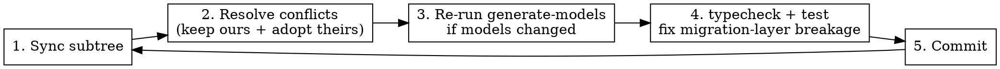

# Maintaining `packages/ai` against upstream pi-ai

Post-migration playbook. The `@ai-sdk` migration (`docs/plans/2026-06-25-pi-ai-ai-sdk-models-dev.md`) is **done**; `packages/ai` is now a subtree of [`earendil-works/pi`](https://github.com/earendil-works/pi) with our migration layered on top. This guide is what to do when upstream pi-ai ships changes.

## The maintenance loop



### 1. Sync the subtree
```bash
./scripts/sync-pi-ai.sh                # pi/main
# requires clean tree; creates a merge commit
```

### 2. Resolve conflicts
Conflicts only happen in **modified-from-upstream** files (see file map). Resolution rule:
- **Keep our migration additions** (the `ai-sdk` variant, `npm` field, `@ai-sdk/*` deps, new files).
- **Adopt the upstream substantive change** (the actual fix/feature the conflict is about).

If the conflict is in `scripts/generate-models.ts` (Phase 4 rewrote it to a generic converter), do NOT take upstream's per-provider blocks back — instead, port upstream's *intent* into `COMPAT_OVERRIDES` or `scripts/models-dev-generic.ts`.

### 3. Re-run model generation (only if upstream added/changed models)
```bash
cd packages/ai && npm run generate-models
git diff packages/ai/src/providers/*.models.ts   # check counts match expectations
```

### 4. Typecheck + test
```bash
cd packages/ai && nub run typecheck   # bar = no NEW errors over baseline
cd packages/ai && nub run test
```
If the migration layer breaks, see "Hot seams" below — upstream changed a type our layer depends on.

### 5. Commit
Per-merge commit on top of the subtree merge.

## File map (what conflicts vs what's clean)

| File | Status | On upstream change |
|------|--------|--------------------|
| `src/api/{anthropic-messages,openai-completions,...}.ts` | upstream-tracked, unchanged by us | syncs cleanly |
| `src/models.ts`, `src/utils/event-stream.ts`, `src/api/lazy.ts`, `src/auth/*` | upstream-tracked, unchanged | syncs cleanly (but see Hot seams) |
| `src/types.ts` | **modified** — added `ai-sdk` Api, `Model.npm`, compat branch | **conflict** — reconcile: keep our additions, adopt theirs |
| `package.json` | **modified** — 10 `@ai-sdk/*` + `ai` deps | **conflict** — keep our deps, merge theirs |
| `scripts/generate-models.ts` | **rewritten** (Phase 4) | **major conflict** — re-port intent, don't restore per-provider blocks |
| `src/providers/all.ts` | **modified** — registers ai-sdk providers (Phase 5.2) | **conflict** — keep `builtinAISdkProviders` |
| `test/*-compat.test.ts` | **modified** — migrated to ai-sdk assertions (Phase 5.3) | **conflict** — keep ai-sdk assertion shape |
| `src/api/ai-sdk.ts`, `src/providers/ai-sdk-{loader,streams,transform,provider}.ts`, `scripts/models-dev-{routing,generic}.ts`, `tsconfig.json` | **ours-only** (migration layer) | no conflict — upstream has no such file |
| `test/ai-sdk-*.test.ts` | **ours-only** | no conflict |

## Hot seams — upstream changes here break our migration layer

These are pi-ai types/interfaces our migration code consumes. If upstream (or a subtree sync) changes any of them, expect typecheck/test failures in the migration layer and fix follow-up:

| Pi-ai seam | Used by | What to check |
|-----------|---------|---------------|
| `Model` interface (`types.ts`) | adapter, loader, transform, provider factory | `npm` field still present; `compat` shape intact |
| `AssistantMessageEvent` union (`types.ts:447`) | adapter (`api/ai-sdk.ts`) | every event still carries accumulated `partial` |
| `Usage` shape (`types.ts:352`) | adapter cost calc | field names for cache/reasoning tokens |
| `OpenAICompletionsCompat` (`types.ts:465`) | transform (`ai-sdk-transform.ts`) | `thinkingFormat` union, `cacheControlFormat`, affinity headers, `supportsLongCacheRetention` |
| `Provider` interface + `createProvider` (`models.ts:32,295`) | `createAISdkProvider` | streams/auth shape matches |
| `calculateCost` (`models.ts:385`) | adapter finish handling | signature + returns `cost.total` |
| `AssistantMessageEventStream` (`utils/event-stream.ts`) | adapter output | yield protocol unchanged |
| `lazyStream`/`lazyApi` (`api/lazy.ts`) | `ai-sdk-streams.ts` | same return signature |
| `ProviderAuth`/`AuthResult`/`ModelAuth` (`auth/types.ts`) | `resolveSdk` | apiKey/baseURL resolution |

## Gotchas

- **`generate-models.ts` is the highest-friction merge** — Phase 4 rewrote it to generic `convertModelsDev()`. Upstream's per-provider fixups now live in our `COMPAT_OVERRIDES` table. Do not blindly accept upstream's version.
- **Per-provider generation counts must match** pre-sync after `npm run generate-models`. If a provider's model count drops, the converter lost a model — fix before committing.
- **`thinkingFormat` values are a closed set** (R4). If upstream adds a new one, our `ai-sdk-transform.ts` switch must gain a matching branch, ported from `openai-completions.ts`.
- **No `console.log`/`any`/Effect-TS** in the migration layer (R4 still applies on maintenance).
- **Version drift:** consumers pin `@earendil-works/pi-ai@0.79.9`; subtree may be at a newer pi version. Reconcile the pin when you bump.

## Quick reference
```bash
./scripts/sync-pi-ai.sh                              # 1. sync
# (resolve conflicts in modified files)              # 2.
cd packages/ai && npm run generate-models            # 3. only if models changed
cd packages/ai && nub run typecheck && nub run test  # 4.
git commit                                           # 5.
```
