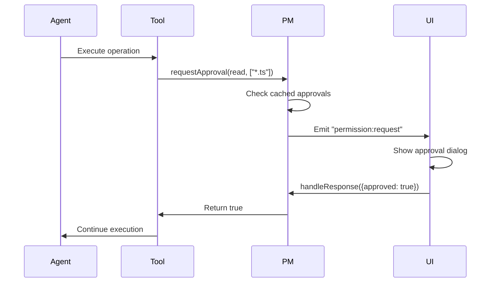

# Security Model and Permission System

## Overview

ekacode's security model is based on **explicit approval** for all privileged operations. This document explains the security architecture, threat model, and permission system design.

## Threat Model

### Adversaries We Protect Against

| Threat                       | Protection            | Mitigation                             |
| ---------------------------- | --------------------- | -------------------------------------- |
| **Malicious LLM output**     | Permission approval   | User must approve dangerous operations |
| **Path traversal attacks**   | Workspace sandbox     | Path canonicalization + validation     |
| **External code execution**  | Shell permission      | Explicit bash approval required        |
| **Unauthorized file access** | Read/Edit permissions | Pattern-based access control           |
| **Session hijacking**        | Ephemeral tokens      | Bearer token regenerated each launch   |

### Out of Scope

We DON'T protect against (user responsibility):

- User intentionally approving malicious operations
- Compromised OpenAI API key
- Malicious code in workspace (agent runs user's code)
- Physical access to unlocked machine

## Security Architecture

### Layers of Security

```
┌─────────────────────────────────────────┐
│         Renderer Process                │
│  (Context isolation, no Node access)    │
└─────────────────┬───────────────────────┘
                  │ IPC (typed bridge)
┌─────────────────▼───────────────────────┐
│         Main Process                    │
│  ├─ Hono Server (Bearer token auth)     │
│  ├─ Permission Manager (approval flow)  │
│  └─ Workspace Instance (sandbox)        │
└─────────────────┬───────────────────────┘
                  │ Tool execution
┌─────────────────▼───────────────────────┐
│         Tools Layer                     │
│  ├─ Filesystem (path validation)        │
│  ├─ Shell (command approval)            │
│  └─ Search (pattern restrictions)       │
└─────────────────────────────────────────┘
```

### Security Boundaries

1. **Renderer → Main**: IPC with `contextBridge`, no Node APIs in renderer
2. **HTTP → Server**: Bearer token required for `/api/*` routes
3. **Agent → Tools**: All tool calls check permissions before execution
4. **Tools → Files**: Workspace sandbox prevents escape

## Permission System Design

### Event-Based Architecture

```typescript
// Tool requests permission
PermissionManager.requestApproval(request)
  → emits "permission:request"
  → waits for response (30s timeout)
  → returns boolean

// UI responds
PermissionManager.handleResponse(response)
  → resolves pending promise
  → caches approval if "always allow"
```

**Why Event-Based?**

- **Non-blocking**: Tools don't freeze while waiting for UI
- **Decoupled**: Permission logic separate from tools
- **Testable**: Can mock events in tests
- **Extensible**: Add more permission types without changing tools

### Permission Flow



### Permission Types

| Type                 | Description              | Default Policy   |
| -------------------- | ------------------------ | ---------------- |
| `read`               | Read file contents       | Ask (cacheable)  |
| `edit`               | Modify files             | Ask (cacheable)  |
| `external_directory` | Access outside workspace | Ask (not cached) |
| `bash`               | Execute shell commands   | Ask (not cached) |

### Caching Strategy

```typescript
// Cache key format: `${sessionID}:${permission}`
approvals.set("session-123:read", new Set(["*.ts", "*.js"]));

// Check approval
function isCached(sessionID, permission, pattern) {
  const approved = approvals.get(`${sessionID}:${permission}`);
  return approved?.has(pattern) ?? false;
}
```

**Cache Rules**:

- Read/Edit: Cached per session
- External/Bash: NOT cached (always ask)
- Cleared on: Session end, user manual clear

### Approval Persistence

Current: In-memory only (cleared on app restart)

Future: Persistent storage options

```typescript
// Future: localStorage-based persistence
interface StoredApproval {
  sessionID: string;
  permission: PermissionType;
  pattern: string;
  timestamp: number;
}
```

## Workspace Sandbox

### Path Validation

```typescript
export function containsPath(parent: string, child: string): boolean {
  const relative = path.relative(parent, child);
  return !relative.startsWith("..");
}
```

**How It Works**:

1. Convert both paths to absolute
2. Compute relative path from parent to child
3. If relative path starts with `..`, child is outside parent

**Examples**:

```typescript
containsPath("/home/user/project", "/home/user/project/src/file.ts");
// → true (inside workspace)

containsPath("/home/user/project", "/etc/passwd");
// → false (outside workspace)

containsPath("/home/user/project", "/home/user/project/../secret");
// → false (path traversal attempt)
```

### External Directory Detection

```typescript
async function assertExternalDirectory(target, workspaceRoot, ask) {
  if (containsPath(workspaceRoot, target)) return; // Inside workspace

  // Ask for permission
  const approved = await ask("external_directory", [path.join(path.dirname(target), "*")]);

  if (!approved) {
    throw new Error(`Permission denied: ${target}`);
  }
}
```

**Why Explicit Approval?**

- Prevents accidental access to sensitive files
- User aware of any out-of-workspace access
- Audit trail of external accesses

## Binary File Detection

### Signature-Based Detection

```typescript
const binarySignatures = [
  [0x50, 0x4b], // ZIP
  [0x89, 0x50, 0x4e], // PNG
  [0xff, 0xd8, 0xff], // JPEG
  // ... more signatures
];

export async function detectBinaryFile(filepath, content) {
  for (const sig of binarySignatures) {
    if (matchesSignature(content, sig)) return true;
  }
  return content.includes(0); // Null byte check
}
```

**Why Detect Binaries?**

- Prevent reading large binary files into memory
- Avoid displaying binary content in chat
- Protect against corrupted terminal output

## Bearer Token Authentication

### Token Generation

```typescript
const SERVER_TOKEN = nanoid(32); // 256-bit random token
```

**Why Nanoid?**

- Cryptographically random
- URL-safe characters
- No need for base64 encoding
- Sufficient entropy (256 bits)

### Token Usage

```typescript
// Client request
fetch("http://127.0.0.1:54321/api/permissions/approve", {
  headers: {
    Authorization: `Bearer ${SERVER_TOKEN}`,
  },
});

// Server validation
app.use("/api/*", async (c, next) => {
  const auth = c.req.header("Authorization");
  if (!auth?.startsWith(`Bearer ${SERVER_TOKEN}`)) {
    return c.json({ error: "Unauthorized" }, 401);
  }
  await next();
});
```

**Security Properties**:

- Token never written to disk (ephemeral)
- Only accessible via IPC from renderer
- Regenerated each app launch
- 256-bit entropy = practically unguessable

## Security Best Practices

### DO

✅ Validate all user inputs
✅ Use path canonicalization before checks
✅ Implement timeout-based fallback denial
✅ Log all permission requests (future)
✅ Use TypeScript strict mode

### DON'T

❌ Trust tool inputs without validation
❌ Allow shell commands without approval
❌ Store tokens in files
❌ Bounce checks to UI (stateful)
❌ Use `eval()` or `Function()`

## Future Enhancements

### Permission Policies

```typescript
// Future: Policy-based permissions
interface PermissionPolicy {
  pattern: string;
  permission: PermissionType;
  decision: "allow" | "ask" | "deny";
  scope: "session" | "project" | "global";
}

// Example policy
const policies: PermissionPolicy[] = [
  {
    pattern: "*.md",
    permission: "read",
    decision: "allow", // Always allow reading markdown
    scope: "global",
  },
];
```

### Audit Log

```typescript
// Future: Audit logging
interface AuditEntry {
  timestamp: number;
  sessionID: string;
  permission: PermissionType;
  pattern: string;
  approved: boolean;
  user: string; // Multi-user support
}
```

### Rate Limiting

```typescript
// Future: Rate limit permission requests
class PermissionRateLimiter {
  private requests = new Map<string, number[]>();

  canRequest(sessionID: string): boolean {
    const now = Date.now();
    const recent = this.requests.get(sessionID) ?? [];
    const lastMinute = recent.filter(t => now - t < 60000);

    if (lastMinute.length > 100) return false; // Too many requests

    lastMinute.push(now);
    this.requests.set(sessionID, lastMinute);
    return true;
  }
}
```

## Testing Security

### Unit Tests

```typescript
describe("containsPath", () => {
  it("should detect path traversal", () => {
    expect(containsPath("/project", "/project/../etc")).toBe(false);
  });

  it("should allow workspace paths", () => {
    expect(containsPath("/project", "/project/src/file.ts")).toBe(true);
  });
});
```

### Integration Tests

```typescript
describe("Permission flow", () => {
  it("should deny on timeout", async () => {
    const approved = await permissionMgr.requestApproval({
      id: "test",
      permission: "read",
      patterns: ["/etc/passwd"],
      always: [],
      sessionID: "test",
    });

    // Timeout after 30s with no response
    expect(approved).toBe(false);
  });
});
```

---

_Updated: 2025-01-25_
