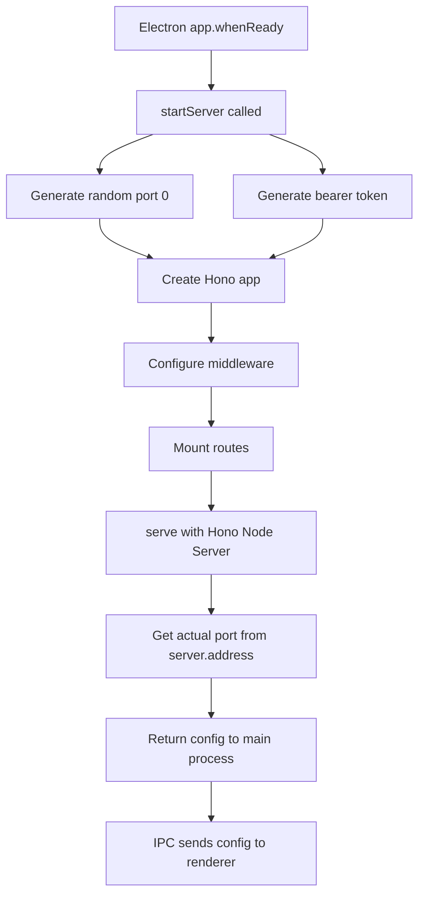

# Hono Server Implementation

## Overview

The Hono server runs in the Electron main process and provides the HTTP API for the ekacode desktop application. This document explains the server architecture, design decisions, and implementation details.

## Why Hono in Main Process?

### Architecture Decision

**Option Chosen**: Hono server in Electron main process

```typescript
// packages/desktop/src/main/index.ts
app.whenReady().then(async () => {
  const server = await startServer(); // Hono server starts here
  serverConfig = { port: server.port, token: server.token };
});
```

### Alternatives Considered

| Approach                          | Pros                                     | Cons                                | Decision    |
| --------------------------------- | ---------------------------------------- | ----------------------------------- | ----------- |
| **Hono in main process** (chosen) | Single binary, offline-first, secure IPC | Requires bundling Node.js           | ✅ Chosen   |
| Separate backend process          | Isolated, can restart independently      | Complex deployment, 2 binaries      | ❌ Rejected |
| Cloud-based API                   | No local resources needed                | Not offline-first, privacy concerns | ❌ Rejected |

### Benefits

1. **Single Binary Distribution**: Electron app includes everything
2. **No Network Exposure**: Server only on 127.0.0.1
3. **Secure IPC**: Renderer gets config via IPC, not HTTP
4. **Offline-First**: Works without internet connection
5. **Simplified Deployment**: One app to install

## Server Architecture

### Startup Flow



### Random Port Allocation

```typescript
const SERVER_PORT = parseInt(process.env.PORT || "0") || 0;
```

**Why Port 0?**

- Port 0 tells OS to assign random available port
- Avoids port conflicts (multiple instances, other apps)
- Works on all platforms (Windows, macOS, Linux)
- No configuration needed from user

**How We Get Actual Port**:

```typescript
const server = await serve({ fetch: app.fetch, port: 0 });
const address = server.address();
const port = typeof address === "object" && address ? address.port : SERVER_PORT;
```

### Bearer Token Generation

```typescript
import { nanoid } from "nanoid";

const SERVER_TOKEN = nanoid(32); // 256-bit random token
```

**Why Nanoid?**

| Property     | Nanoid   | UUID v4          | crypto.randomBytes |
| ------------ | -------- | ---------------- | ------------------ |
| Entropy      | 256 bits | 122 bits         | Configurable       |
| Length       | 32 chars | 36 chars         | Base64 encoded     |
| Characters   | URL-safe | Includes hyphens | Base64 (+, /)      |
| Dependencies | 1        | 1                | 0 (built-in)       |

**Chosen Nanoid because**:

- Highest entropy per character
- URL-safe (no encoding needed)
- Small, fast, no native dependencies

**Security**:

- 256 bits = practically unguessable
- Even with 1B requests/sec, takes 10^71 years to brute force
- Regenerated each launch (no persistence = no theft)

## Middleware Stack

### CORS Configuration

```typescript
app.use("*", async (c, next) => {
  c.header("Access-Control-Allow-Origin", "*");
  c.header("Access-Control-Allow-Methods", "GET, POST, PUT, DELETE, OPTIONS");
  c.header("Access-Control-Allow-Headers", "Content-Type, Authorization");

  if (c.req.method === "OPTIONS") {
    return c.newResponse(null, 204);
  }

  await next();
});
```

**Why Allow All Origins?**

- Server only listens on 127.0.0.1 (localhost only)
- External requests cannot reach server (OS firewall)
- Same-origin policy not needed for local-only service
- Simplifies development (no CORS errors)

**Why Handle OPTIONS Explicitly?**

- Browsers send OPTIONS preflight before POST
- Must respond with 204 (No Content)
- Without this, preflight fails and POST never sent

### Authentication Middleware

```typescript
app.use("/api/*", async (c, next) => {
  const auth = c.req.header("Authorization");
  if (!auth?.startsWith(`Bearer ${SERVER_TOKEN}`)) {
    return c.json({ error: "Unauthorized" }, 401);
  }
  await next();
});
```

**Why Only Protect `/api/*`?**

- `/system/status` and `/api/config` are public
- Renderer needs `/api/config` to get token
- Prevents chicken-and-egg problem (need token to get token)

**Why Not Use HTTP Basic Auth?**

- Requires encoding credentials (more complex)
- Browser shows auth dialog (bad UX)
- Bearer token is modern standard

## API Endpoints

### Public Endpoints

```typescript
// Health check
app.get("/", c => c.text("ekacode server running"));

// System status (for renderer to check server)
app.get("/system/status", c =>
  c.json({
    status: "ok",
    version: "0.0.1",
  })
);

// Server configuration (for renderer to get token)
app.get("/api/config", c =>
  c.json({
    token: SERVER_TOKEN,
    baseUrl: `http://127.0.0.1:${SERVER_PORT}`,
  })
);
```

### Protected Endpoints

```typescript
// Permission API (mounted sub-router)
app.route("/api/permissions", permissionsRouter);

// POST /api/permissions/approve - Approve permission request
// GET  /api/permissions/pending - Get pending requests
// POST /api/permissions/session/:id/clear - Clear session approvals
```

## Request/Response Flow

### Example: Permission Approval

```typescript
// 1. Tool requests permission
const request = {
  id: nanoid(),
  permission: "edit",
  patterns: ["/home/user/project/src/*.ts"],
  always: [],
  sessionID: "session-123",
};

// 2. PermissionManager emits event
permissionMgr.emit("permission:request", request);

// 3. Renderer polls pending requests
const response = await fetch(`${baseUrl}/api/permissions/pending`, {
  headers: { Authorization: `Bearer ${token}` },
});

// 4. User approves, renderer sends approval
await fetch(`${baseUrl}/api/permissions/approve`, {
  method: "POST",
  headers: {
    Authorization: `Bearer ${token}`,
    "Content-Type": "application/json",
  },
  body: JSON.stringify({
    id: request.id,
    approved: true,
    patterns: ["/home/user/project/src/*.ts"],
  }),
});
```

## Error Handling

### Current Approach

```typescript
// Zod validation
try {
  const body = await c.req.json();
  const { id, approved, patterns } = approvalSchema.parse(body);
  // ... process
} catch (error) {
  return c.json({ error: error.message }, 400);
}
```

### Error Response Format

```typescript
// Validation error
{
  "error": "Invalid approval request: missing 'id' field"
}

// Authentication error
{
  "error": "Unauthorized"
}

// Not found
// (Handled by Hono's default 404)
```

## Performance Considerations

### Connection Keep-Alive

```typescript
// @hono/node-server uses Node's HTTP server
// Keep-alive enabled by default
```

Benefits:

- Avoids TCP handshake for each request
- Reduces latency for repeated requests
- Better for polling (permission pending status)

### No Body Parsing Middleware

```typescript
// We parse body manually when needed
const body = await c.req.json();
```

**Why Not Use Body Parsing Middleware?**

- Only some endpoints need JSON
- Avoids parsing overhead for GET requests
- Explicit is better than implicit

## Security Properties

### Network Isolation

```typescript
// Server only binds to localhost
// Cannot be accessed from external network
serve({
  fetch: app.fetch,
  port: SERVER_PORT,
  // hostname: "127.0.0.1" // Default behavior
});
```

**Verification**:

```bash
# From same machine (works)
curl http://127.0.0.1:54321/system/status

# From another machine (fails - connection refused)
curl http://192.168.1.100:54321/system/status
```

### Token Security

- Token in memory only (never written to disk)
- Passed via IPC (not accessible to renderer JavaScript)
- Regenerated each launch (rotation for free)
- 256-bit entropy (practically unguessable)

### Route Protection

```
Public Routes:
- GET  /                     (health check)
- GET  /system/status        (server status)
- GET  /api/config           (bootstrap for renderer)

Protected Routes (Bearer token required):
- POST /api/permissions/approve
- GET  /api/permissions/pending
- POST /api/permissions/session/:id/clear
```

## Graceful Shutdown

### Current Implementation

```typescript
// Server closes when Electron app quits
app.on("window-all-closed", () => {
  if (process.platform !== "darwin") {
    // TODO: Graceful server shutdown
    app.quit();
  }
});
```

### Future Enhancement

```typescript
// Graceful shutdown handler
export async function stopServer(server: Server) {
  return new Promise(resolve => {
    server.close(() => {
      console.log("Server closed gracefully");
      resolve();
    });
  });
}

// Call before app quit
app.on("before-quit", async () => {
  if (server) {
    await stopServer(server);
  }
});
```

## Troubleshooting

### Port Already in Use

**Symptom**: `EADDRINUSE` error

**Cause**: Previous instance didn't clean up

**Fix**:

```bash
# Find process using port
lsof -i :54321

# Kill process
kill -9 <PID>
```

### Token Validation Fails

**Symptom**: 401 errors from renderer

**Cause**: Token mismatch between main and renderer

**Debugging**:

```typescript
// Log token in main process
console.log("Server token:", SERVER_TOKEN);

// Log token in renderer
console.log("Renderer token:", serverConfig.token);

// Should be identical
```

### CORS Errors

**Symptom**: Browser console shows CORS error

**Cause**: OPTIONS request not handled

**Fix**: Ensure CORS middleware is first and handles OPTIONS

---

_Updated: 2025-01-25_
