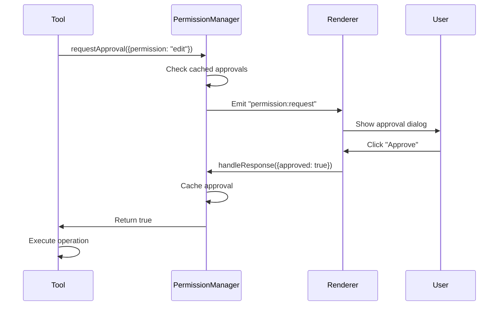

# Permission System Implementation

## Overview

The permission system is the security layer that protects users from unintended actions by AI agents. This document explains the event-based architecture, implementation details, and design decisions.

## Design Philosophy

### Core Principle

**"Nothing happens without user consent"**

All privileged operations (file edits, shell commands, external access) require explicit user approval. The system is designed with:

1. **Explicit Approval**: Every privileged operation shows a dialog
2. **Session Caching**: "Always allow" persists for session
3. **Timeout Fallback**: Auto-deny if no response in 30 seconds
4. **Audit Trail**: All requests logged (future)

### Threat Model

| Threat                                | Protection                 |
| ------------------------------------- | -------------------------- |
| AI hallucinates malicious commands    | Explicit approval required |
| Agent tries to access sensitive files | Workspace sandbox          |
| Tool tries to escape workspace        | Path validation            |
| User accidentally approves            | Clear UI with diffs shown  |

## Event-Based Architecture

### Why Events?

```typescript
// PermissionManager extends EventEmitter
export class PermissionManager extends EventEmitter {
  async requestApproval(request: PermissionRequest): Promise<boolean> {
    this.emit("permission:request", request);
    // Wait for response...
  }
}
```

**Benefits**:

1. **Decoupled**: Tools don't know about UI
2. **Non-blocking**: Tools don't freeze waiting for UI
3. **Testable**: Mock events in tests
4. **Extensible**: Add listeners for logging, analytics

### Request Flow



### Event Listeners

```typescript
// Main process: Forward to renderer
permissionMgr.on("permission:request", request => {
  mainWindow?.webContents.send("permission:request", request);
});

// Renderer: Listen and show UI
ipcRenderer.on("permission:request", (event, request) => {
  showApprovalDialog(request);
});

// Renderer: Send response
ipcRenderer.send("permission:response", {
  id: request.id,
  approved: true,
});

// Main process: Handle response
ipcMain.on("permission:response", (event, response) => {
  permissionMgr.handleResponse(response);
});
```

## PermissionManager Implementation

### Singleton Pattern

```typescript
export class PermissionManager extends EventEmitter {
  private static instance: PermissionManager;

  static getInstance(): PermissionManager {
    if (!this.instance) {
      this.instance = new PermissionManager();
    }
    return this.instance;
  }
}
```

**Why Singleton?**

- Single permission state for entire app
- All tools access same approval cache
- Simplifies testing (reset between tests)
- Thread-safe in Node.js (single-threaded)

### State Management

```typescript
private pendingRequests = new Map<string, {
  request: PermissionRequest;
  resolve: (approved: boolean) => void;
  timeout: NodeJS.Timeout;
}>();

private approvals = new Map<string, Set<string>>();
```

**State Structures**:

1. **pendingRequests**: Active requests waiting for response
2. **approvals**: Cache of approved patterns per session

**Cache Key Format**: `${sessionID}:${permission}`

```typescript
// Example cache
approvals = {
  "session-123:read": new Set(["*.ts", "*.js", "*.md"]),
  "session-123:edit": new Set(["/home/user/project/src/*"]),
};
```

### Request Lifecycle

```typescript
async requestApproval(request: PermissionRequest): Promise<boolean> {
  const cacheKey = `${request.sessionID}:${request.permission}`;

  // 1. Check "always" patterns (auto-approve)
  const alwaysApproved = this.approvals.get(cacheKey);
  if (alwaysApproved && request.always.some(p => this.matchesPattern(p, request.patterns))) {
    return true;
  }

  // 2. Check cached approvals
  if (alwaysApproved) {
    for (const pattern of request.patterns) {
      if (alwaysApproved.has(pattern)) {
        return true;
      }
    }
  }

  // 3. Emit event and wait for response
  this.emit("permission:request", request);

  // 4. Wait with timeout
  return new Promise((resolve) => {
    const timeout = setTimeout(() => {
      this.pendingRequests.delete(request.id);
      resolve(false); // Deny on timeout
    }, 30000);

    this.pendingRequests.set(request.id, {
      request,
      resolve,
      timeout
    });
  });
}
```

### Response Handling

```typescript
handleResponse(response: PermissionResponse): void {
  const pending = this.pendingRequests.get(response.id);
  if (!pending) return; // Already handled or expired

  // Clear timeout
  clearTimeout(pending.timeout);
  this.pendingRequests.delete(response.id);

  // Cache approval if requested
  if (response.approved && response.patterns) {
    const cacheKey = `${pending.request.sessionID}:${pending.request.permission}`;
    if (!this.approvals.has(cacheKey)) {
      this.approvals.set(cacheKey, new Set());
    }
    response.patterns.forEach(p => this.approvals.get(cacheKey)!.add(p));
  }

  // Resolve the waiting promise
  pending.resolve(response.approved);
}
```

## Pattern Matching

### Glob-to-Regex Conversion

```typescript
private matchesPattern(pattern: string, targets: string[]): boolean {
  const regex = new RegExp(
    "^" + pattern.replace(/\*/g, ".*").replace(/\?/g, ".") + "$"
  );
  return targets.some(t => regex.test(t));
}
```

**Examples**:

```typescript
matchesPattern("*.ts", ["file.ts", "file.js"]);
// → true (matches file.ts)

matchesPattern("src/**/*.ts", ["src/components/Button.ts"]);
// → true (matches nested path)

matchesPattern("/etc/*", ["/etc/passwd"]);
// → true (matches specific file)
```

### Pattern Use Cases

| Pattern        | Meaning          | Use Case                               |
| -------------- | ---------------- | -------------------------------------- |
| `*.ts`         | Any .ts file     | Auto-approve reading TypeScript        |
| `src/*`        | Any file in src/ | Auto-approve edits in source directory |
| `/tmp/*`       | Any file in /tmp | Allow temp file access                 |
| `package.json` | Specific file    | Always allow reading config            |

## Permission Types

### Type Definitions

```typescript
export type PermissionType =
  | "read" // Read file contents
  | "edit" // Modify files
  | "external_directory" // Access outside workspace
  | "bash"; // Execute shell commands
```

### Permission Behavior

| Type                 | Cached? | Default | Description                    |
| -------------------- | ------- | ------- | ------------------------------ |
| `read`               | ✅ Yes  | Ask     | Read file contents             |
| `edit`               | ✅ Yes  | Ask     | Write/edit files               |
| `external_directory` | ❌ No   | Ask     | Access files outside workspace |
| `bash`               | ❌ No   | Ask     | Execute shell commands         |

**Why Cache Some But Not Others?**

- **Read/Edit**: Low risk, common operations → Cache for UX
- **External/Bash**: Higher risk, less common → Always ask

### Future: Network Permission

```typescript
// Phase 2.4: Add network permission
type PermissionType = "read" | "edit" | "external_directory" | "bash" | "network"; // NEW: Web requests

// Cached? No (network access always risky)
```

## Session Management

### Session Lifecycle

```typescript
// Session starts
const sessionID = nanoid();

// During session
await permissionMgr.requestApproval({
  sessionID,
  // ...
});

// Session ends
permissionMgr.clearSession(sessionID);
```

### Clearing Session

```typescript
clearSession(sessionID: string): void {
  for (const [key] of this.approvals) {
    if (key.startsWith(`${sessionID}:`)) {
      this.approvals.delete(key);
    }
  }
}
```

**When to Clear**:

- User clicks "Clear Approvals" button
- Workspace changes
- Session timeout (future)

## Integration Points

### Tool Integration

```typescript
// In tool execute method
execute: async ({ filePath }, context) => {
  const sessionID = context.sessionID;

  const approved = await permissionMgr.requestApproval({
    id: nanoid(),
    permission: "read",
    patterns: [filePath],
    always: ["*.md"], // Auto-approve markdown files
    sessionID,
    metadata: { filePath },
  });

  if (!approved) {
    throw new Error("Permission denied");
  }

  // Perform operation...
};
```

### IPC Integration

```typescript
// Main process
ipcMain.on("permission:response", (event, response) => {
  permissionMgr.handleResponse(response);
});

// Renderer process
function sendPermissionResponse(id: string, approved: boolean) {
  ipcRenderer.send("permission:response", { id, approved });
}
```

### UI Integration

```typescript
// Renderer: Permission dialog component
function PermissionDialog({ request }: { request: PermissionRequest }) {
  return (
    <Dialog>
      <h2>Permission Required</h2>
      <p>{request.permission} access requested for:</p>
      <ul>
        {request.patterns.map(p => <li>{p}</li>)}
      </ul>
      <Checkbox label="Always allow for this session" />
      <Button onClick={() => approve()}>Approve</Button>
      <Button onClick={() => deny()}>Deny</Button>
    </Dialog>
  );
}
```

## Error Handling

### Timeout Behavior

```typescript
const timeout = setTimeout(() => {
  this.pendingRequests.delete(request.id);
  resolve(false); // Deny by default
}, 30000); // 30 seconds
```

**Why 30 Seconds?**

- Long enough for user to see dialog and decide
- Short enough to prevent indefinite hanging
- Industry standard for interactive dialogs

### Invalid Response

```typescript
handleResponse(response: PermissionResponse): void {
  const pending = this.pendingRequests.get(response.id);
  if (!pending) {
    // Request already expired or handled
    return; // Silently ignore
  }
  // ...
}
```

## Testing

### Unit Tests

```typescript
describe("PermissionManager", () => {
  beforeEach(() => {
    PermissionManager.reset(); // Clear state
  });

  it("should approve cached pattern", async () => {
    const pm = PermissionManager.getInstance();
    pm.approvePattern("session-1", "read", "*.ts");

    const approved = await pm.requestApproval({
      id: "req-1",
      permission: "read",
      patterns: ["file.ts"],
      always: [],
      sessionID: "session-1",
    });

    expect(approved).toBe(true);
  });

  it("should timeout after 30 seconds", async () => {
    const pm = PermissionManager.getInstance();

    const approved = await pm.requestApproval({
      id: "req-1",
      permission: "edit",
      patterns: ["/etc/passwd"],
      always: [],
      sessionID: "session-1",
    });

    // No response sent, should deny after timeout
    expect(approved).toBe(false);
  });
});
```

### Integration Tests

```typescript
describe("Permission flow", () => {
  it("should handle full approval cycle", async () => {
    const pm = PermissionManager.getInstance();

    // Start request
    const requestPromise = pm.requestApproval({
      id: "req-1",
      permission: "edit",
      patterns: ["file.ts"],
      always: [],
      sessionID: "session-1",
    });

    // Simulate UI response
    pm.handleResponse({
      id: "req-1",
      approved: true,
      patterns: ["*.ts"],
    });

    // Verify approved
    const approved = await requestPromise;
    expect(approved).toBe(true);

    // Verify cached
    const cached = pm.requestApproval({
      id: "req-2",
      permission: "edit",
      patterns: ["another.ts"],
      always: [],
      sessionID: "session-1",
    });
    expect(await cached).toBe(true);
  });
});
```

## Future Enhancements

### Approval Policies

```typescript
// Future: Rule-based approvals
interface ApprovalPolicy {
  pattern: string;
  permission: PermissionType;
  decision: "allow" | "ask" | "deny";
  duration: "session" | "1hour" | "forever";
}

// Example policies
const policies: ApprovalPolicy[] = [
  {
    pattern: "*.md",
    permission: "read",
    decision: "allow", // Always allow reading markdown
    duration: "forever",
  },
  {
    pattern: "*.ts",
    permission: "edit",
    decision: "ask",
    duration: "session", // Ask, but cache for session
  },
];
```

### Approval Groups

```typescript
// Future: Bulk approvals
interface GroupedPermissionRequest {
  id: string;
  requests: PermissionRequest[];
  sessionID: string;
}

// UI shows all requests at once
<PermissionDialog requests={grouped.requests} />
```

### Audit Log

```typescript
// Future: Track all permission events
interface AuditEntry {
  timestamp: number;
  sessionID: string;
  request: PermissionRequest;
  response: PermissionResponse;
  duration: number; // Time to decide
}

// Write to log
auditLog.write({
  timestamp: Date.now(),
  sessionID: "session-1",
  request: {
    /* ... */
  },
  response: { approved: true },
  duration: 2500, // User took 2.5 seconds
});
```

---

_Updated: 2025-01-25_
