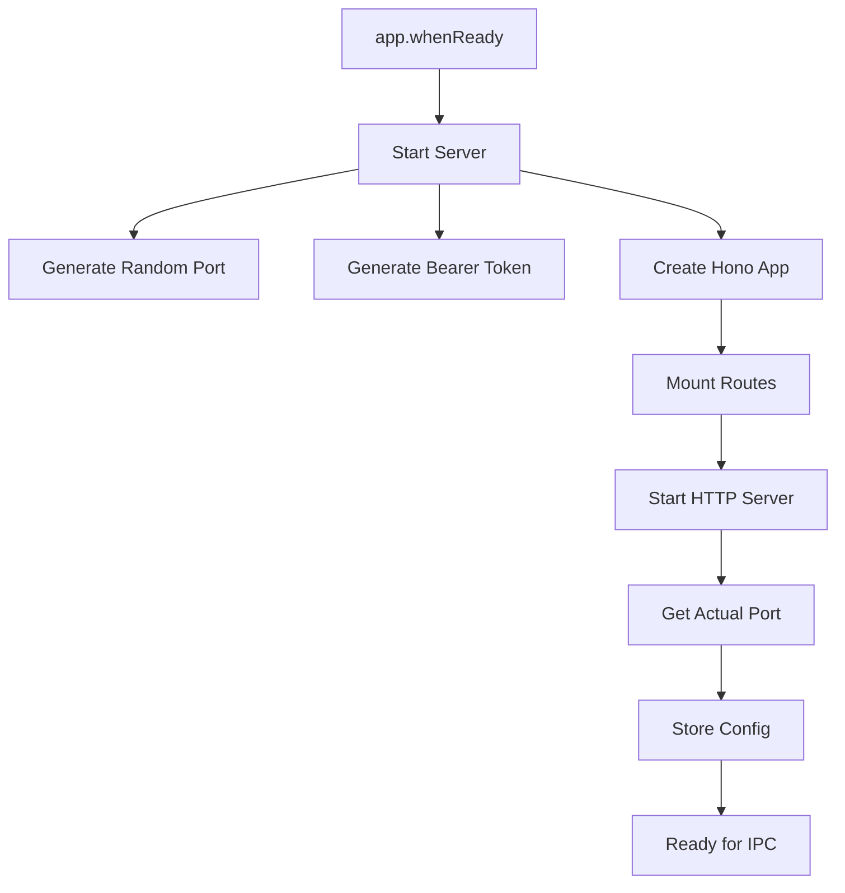

# Server Management in Desktop

## Overview

The Hono server runs as part of the Electron main process. This document explains the server lifecycle, configuration management, and integration with the desktop application.

## Architecture

### Server in Main Process

```typescript
// packages/desktop/src/main/index.ts
app.whenReady().then(async () => {
  // Start Hono server in main process
  const server = await startServer();
  serverConfig = { port: server.port, token: server.token };
});
```

**Why In Main Process?**

- Single binary distribution
- No separate backend process to manage
- Direct access to Node.js APIs
- Simpler deployment

### Server Flow



## Startup Sequence

### Initialization

```typescript
// packages/desktop/src/main/index.ts
let serverConfig: { port: number; token: string } | null = null;

app.whenReady().then(async () => {
  electronApp.setAppUserModelId("com.ekacode.app");

  // 1. Start Hono server
  try {
    const server = await startServer();
    serverConfig = {
      port: server.port,
      token: server.token,
    };
    console.log(`ekacode: Server started on port ${server.port}`);
  } catch (error) {
    console.error("ekacode: Failed to start server", error);
  }

  // 2. Create window
  createWindow();

  // 3. Handle app activation
  app.on("activate", function () {
    if (BrowserWindow.getAllWindows().length === 0) createWindow();
  });
});
```

### Server Configuration

```typescript
// packages/server/src/index.ts
export async function startServer() {
  const SERVER_PORT = parseInt(process.env.PORT || "0") || 0;
  const SERVER_TOKEN = nanoid(32);

  const server = await serve({
    fetch: app.fetch,
    port: SERVER_PORT,
  });

  const address = server.address();
  const port = typeof address === "object" && address ? address.port : SERVER_PORT;

  console.log(`ekacode server running on http://127.0.0.1:${port}`);
  console.log(`Server token: ${SERVER_TOKEN}`);

  return { server, port, token: SERVER_TOKEN };
}
```

## Config Distribution

### Main Process Storage

```typescript
// Main process stores config
let serverConfig: { port: number; token: string } | null = null;
```

**Why In-Memory Only?**

- Token is ephemeral (regenerated each launch)
- No persistence needed (security)
- Fast access (no disk I/O)

### IPC Distribution

```typescript
// Main process provides config
ipcMain.handle("get-server-config", async () => {
  if (!serverConfig) {
    throw new Error("Server not initialized");
  }
  return {
    baseUrl: `http://127.0.0.1:${serverConfig.port}`,
    token: serverConfig.token,
  };
});
```

**Why Handler Pattern?**

- Server starts asynchronously
- Config not ready immediately
- Handler ensures readiness before returning

### Renderer Access

```typescript
// Renderer process requests config
const config = await window.ekacode.getServerConfig();
// { baseUrl: "http://127.0.0.1:54321", token: "..." }

// Use config for API calls
const response = await fetch(`${config.baseUrl}/api/permissions/pending`, {
  headers: {
    Authorization: `Bearer ${config.token}`,
  },
});
```

## Error Handling

### Startup Failure

```typescript
app.whenReady().then(async () => {
  try {
    const server = await startServer();
    serverConfig = { port: server.port, token: server.token };
  } catch (error) {
    console.error("ekacode: Failed to start server", error);
    // Show error dialog to user
    dialog.showErrorBox(
      "Server Error",
      "Failed to start ekacode server. The app may not function correctly."
    );
  }
});
```

### Port Conflicts

```typescript
// Port 0 tells OS to assign random available port
const SERVER_PORT = 0;

// If OS has no available ports, serve() will throw
try {
  const server = await serve({ fetch: app.fetch, port: 0 });
} catch (error) {
  if (error.code === "EADDRINUSE") {
    throw new Error("No available ports for server");
  }
  throw error;
}
```

## Lifecycle Management

### Current State

```typescript
// Server starts when app is ready
app.whenReady().then(async () => {
  await startServer();
});

// Server closes when app quits (implicit)
app.on("window-all-closed", () => {
  if (process.platform !== "darwin") {
    app.quit();
  }
});
```

### Future: Graceful Shutdown

```typescript
// Future: Explicit server shutdown
let server: Server | null = null;

export async function stopServer() {
  if (!server) return;

  return new Promise<void>(resolve => {
    server.close(() => {
      console.log("Server closed gracefully");
      server = null;
      resolve();
    });
  });
}

// Call before quit
app.on("before-quit", async event => {
  if (server) {
    event.preventDefault(); // Prevent immediate quit
    await stopServer();
    app.quit(); // Quit after cleanup
  }
});
```

### Future: Restart on Settings Change

```typescript
// Future: Restart server when settings change
ipcMain.handle("restart-server", async () => {
  // Stop existing server
  await stopServer();

  // Start new server with new settings
  const newServer = await startServer();
  serverConfig = {
    port: newServer.port,
    token: newServer.token,
  };

  return serverConfig;
});
```

## Configuration Options

### Environment Variables

```bash
# Server port (0 = random)
PORT=0

# Future: Other options
EKACODE_LOG_LEVEL=debug
EKACODE_TIMEOUT=30000
```

### Future: User Settings

```typescript
// Future: Persisted user settings
interface ServerSettings {
  port?: number; // undefined = random
  timeout: number; // Request timeout
  logLevel: "debug" | "info" | "error";
}

// Load from settings store
const settings = await loadSettings();
const server = await startServer(settings);
```

## Security

### Token Generation

```typescript
import { nanoid } from "nanoid";

const SERVER_TOKEN = nanoid(32); // 256-bit random token
```

**Security Properties**:

- **Cryptographically random**: Uses `crypto.randomBytes()`
- **256-bit entropy**: 2^256 possibilities (practically infinite)
- **URL-safe**: No special characters to encode
- **Ephemeral**: Regenerated each launch (rotation)

### Network Isolation

```typescript
// Server only binds to loopback
serve({
  fetch: app.fetch,
  port: 0,
  // Default: 127.0.0.1 only
});
```

**Verification**:

```bash
# From same machine (works)
curl http://127.0.0.1:54321/system/status

# From network (fails)
curl http://192.168.1.100:54321/system/status
# Connection refused
```

### Token Exposure

**Where Token Goes**:

1. Main process memory (ephemeral)
2. IPC message to renderer (secure channel)
3. Renderer memory (session only)
4. HTTP headers (localhost only)

**Where Token NEVER Goes**:

- ❌ Written to disk
- ❌ Stored in localStorage
- ❌ Sent over network (localhost only)
- ❌ Logged to console

## Performance

### Startup Time

```typescript
// Server startup is fast
const startTime = Date.now();
const server = await startServer();
const elapsed = Date.now() - startTime;
console.log(`Server started in ${elapsed}ms`);
```

**Expected**: < 100ms (no blocking operations)

### Memory Usage

```typescript
// Server uses minimal memory
const mbUsed = process.memoryUsage().heapUsed / 1024 / 1024;
console.log(`Server memory: ${mbUsed.toFixed(2)} MB`);
```

**Expected**: < 50 MB (Node.js + Hono overhead)

### Connection Handling

```typescript
// @hono/node-server handles connections efficiently
// - Keep-alive enabled by default
// - No connection limit (localhost only)
// - Automatic request parsing
```

## Troubleshooting

### Server Not Starting

**Symptom**: IPC handler throws "Server not initialized"

**Debug**:

```typescript
// Add logging
app.whenReady().then(async () => {
  try {
    const server = await startServer();
    console.log("Server started:", server);
    serverConfig = { port: server.port, token: server.token };
  } catch (error) {
    console.error("Server startup failed:", error);
    console.error("Stack:", error.stack);
  }
});
```

### Port Already in Use

**Symptom**: `EADDRINUSE` error

**Cause**: Previous instance didn't clean up

**Fix**:

```bash
# Find process using port
lsof -i :54321

# Kill process
kill -9 <PID>
```

### Token Validation Fails

**Symptom**: 401 errors from renderer

**Debug**:

```typescript
// Log tokens in both processes
console.log("Main token:", serverConfig.token);
// Renderer: console.log("Renderer token:", config.token);

// Should be identical
```

## Testing

### Unit Tests

```typescript
describe("Server startup", () => {
  it("should start on random port", async () => {
    const { port, token } = await startServer();
    expect(port).toBeGreaterThan(0);
    expect(token).toHaveLength(32);
  });

  it("should respond to health check", async () => {
    const server = await startServer();
    const response = await fetch(`http://127.0.0.1:${server.port}/`);
    const text = await response.text();
    expect(text).toBe("ekacode server running");
  });
});
```

### Integration Tests

```typescript
describe("Desktop integration", () => {
  let app: Application;

  beforeAll(async () => {
    app = await electron.start({
      args: [path.join(__dirname, "..")],
    });
  });

  afterAll(async () => {
    await app.stop();
  });

  it("should start server on app ready", async () => {
    const config = await app.client.getWindow().evaluate(async () => {
      return await window.ekacode.getServerConfig();
    });

    expect(config).toHaveProperty("baseUrl");
    expect(config).toHaveProperty("token");
  });
});
```

## Future Enhancements

### Health Monitoring

```typescript
// Future: Monitor server health
setInterval(() => {
  if (server) {
    const uptime = process.uptime();
    const mem = process.memoryUsage();
    console.log(`Server health: uptime=${uptime}s, mem=${mem.heapUsed}MB`);
  }
}, 60000); // Every minute
```

### Graceful Restart

```typescript
// Future: Restart without closing app
async function restartServer() {
  const oldPort = serverConfig?.port;

  // Stop old server
  await stopServer();

  // Start new server
  const newServer = await startServer();
  serverConfig = {
    port: newServer.port,
    token: newServer.token,
  };

  // Notify renderer
  mainWindow?.webContents.send("server:restarted", serverConfig);
}
```

### Server Statistics

```typescript
// Future: Expose server stats
app.get("/api/stats", c => {
  return c.json({
    uptime: process.uptime(),
    memory: process.memoryUsage(),
    requests: requestCounter,
    errors: errorCounter,
  });
});
```

---

_Updated: 2025-01-25_
